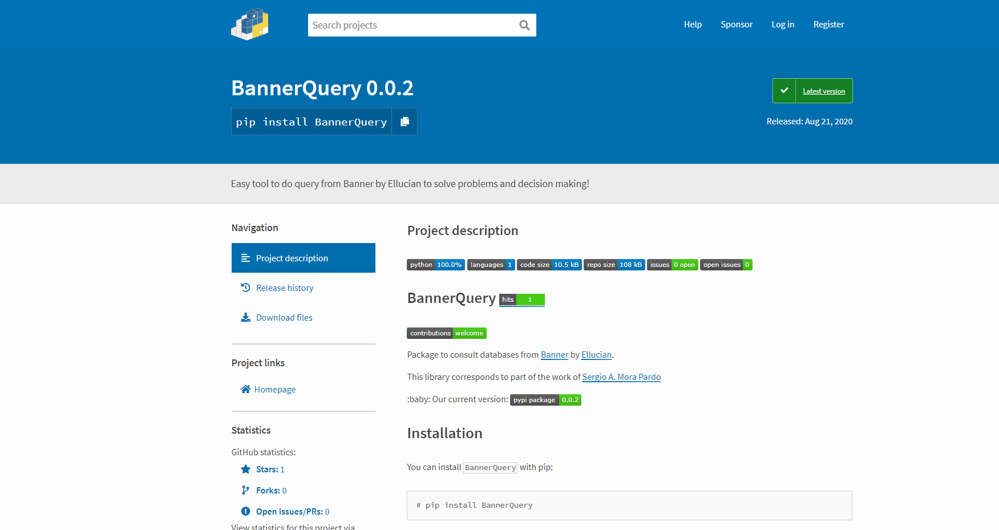

    



# BannerQuery [](http://hits.dwyl.com/sergiomora03/BannerQuery)

[](https://github.com/sergiomora03/BannerQuery/issues) 

Package to consult databases from [Banner](https://www.ellucian.com/es/soluciones/ellucian-banner) by [Ellucian](https://www.ellucian.com/es).

This library corresponds to part of the work of [Sergio A. Mora Pardo](https://sergiomora03.github.io/)

👶 Our current version: [](https://badge.fury.io/py/BannerQuery) 

# Installation

 

You can install ```BannerQuery``` with pip:

```
# pip install BannerQuery
```

# Documentation

Documentation is available at http://sergiomora03.github.io/BannerQuery

Tutorials are available at http://sergiomora03.github.io/BannerQuery/Tutorials.html

# Development   

Source code is available at https://github.com/sergiomora03/BannerQuery

https://packaging.python.org/tutorials/creating-documentation/
